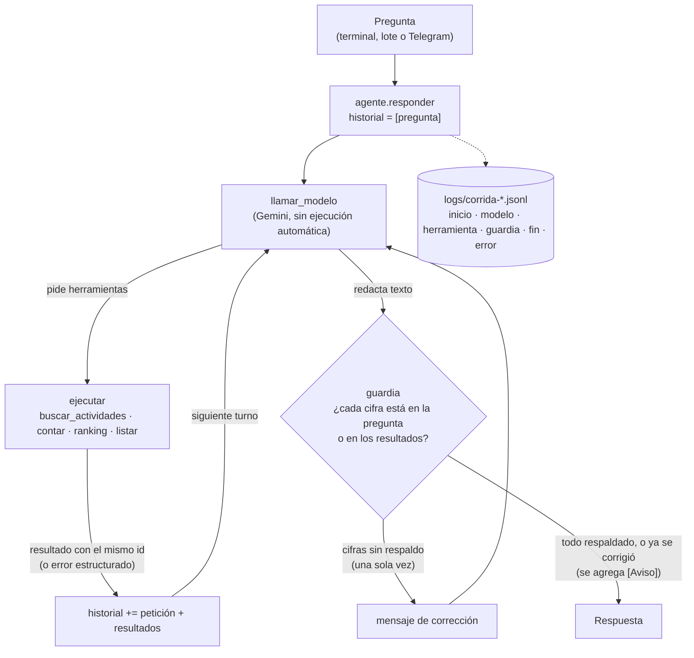
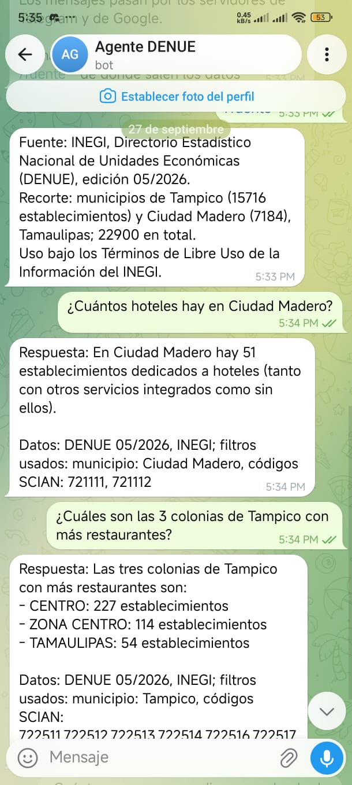

# Agente analista del DENUE · Tampico y Ciudad Madero

- **Alumno:** Carlos Alberto Pérez Reyna
- **Número de control:** 23070497
- **Asignatura:** Desarrollo de Agentes Inteligentes (ACD-2504), grupo 850P-A
- **Docente:** D. C. C. Alejandro Estrada Padilla
- **Trabajo:** Proyecto · Unidad 1
- **Entrega:** 30 de septiembre de 2026

## Qué hace y por qué es un agente

Responde en español preguntas sobre los 22,900 establecimientos de Tampico y Ciudad Madero registrados en el DENUE: cuántos negocios hay de un giro, en qué municipio, colonia o sector hay más, cuáles son las actividades más comunes o qué empresas grandes existen. El modelo de lenguaje **nunca ve los datos**: el CSV pesa 4.9 MB, no cabe en el prompt, y un modelo no cuenta filas con exactitud. Solo ve la descripción de cuatro herramientas y **decide** cuál pedir y con qué argumentos. El código la ejecuta con pandas, le devuelve el resultado y repite hasta que el modelo tiene la respuesta: percibir (la pregunta y los resultados), decidir (el modelo elige la herramienta), actuar (el código consulta los datos) y observar. Ese ciclo, con presupuesto de turnos y herramientas, es el agente. Además, una **guardia** revisa con código que cada cifra de la respuesta venga de una herramienta antes de mostrarla. La misma función `agente.responder` atiende la terminal y un bot de Telegram.

## Los datos

- **Fuente:** INEGI, *Directorio Estadístico Nacional de Unidades Económicas* (DENUE), edición **05/2026**, entidad 28 (Tamaulipas). Se usa bajo los Términos de Libre Uso de la Información del INEGI; cada respuesta del agente cita la fuente.
- **Recorte:** municipios de Tampico (15,716 establecimientos) y Ciudad Madero (7,184), en `data/denue_tampico_madero.csv`, sin modificar. El docente retiró la razón social, el teléfono, el correo y el sitio web.
- **Columnas principales:** `nombre`, `codigo_act` (clase SCIAN de 6 dígitos, leída como texto), `actividad`, `sector`, `estrato` (personal ocupado en 7 rangos), `municipio`, `colonia`. Los nombres de los sectores están en `data/sectores_scian.csv`.
- **Lo que no tiene:** el número exacto de empleados (solo el estrato), ventas, ingresos, ganancias, salarios u opiniones. Los nombres de colonia se capturaron a mano y un mismo lugar aparece escrito de varias formas (CENTRO, ZONA CENTRO, TAMPICO CENTRO…).

## Arquitectura



Límites: `MAX_TURNOS = 5` llamadas al modelo y `MAX_HERRAMIENTAS = 6` herramientas ejecutadas por pregunta. En el último turno, o al agotar las herramientas, `forzar_texto` pone el modo `NONE`, que prohíbe al modelo pedir más herramientas.

## Herramientas

Todas devuelven `ok`, `fuente` y (salvo `buscar_actividades`) los `filtros` aplicados con el valor ya corregido. Un argumento inválido produce `{"ok": false, "error": ..., "valores_validos": [...]}`. Los filtros comunes (`municipio`, `codigo_act`, `sector`, `estrato`, `colonia`) se combinan con «y».

| Herramienta | Recibe | Devuelve | Cuándo la usa el modelo |
|---|---|---|---|
| `buscar_actividades` | `texto` | Hasta 15 clases `{codigo_act, actividad, establecimientos}` de ambos municipios cuyo nombre contiene todas las palabras (plurales sencillos) | Antes de contar un giro, para conocer sus códigos SCIAN |
| `contar` | filtros | `total` de establecimientos | «¿Cuántos…?» |
| `ranking` | `por`, `top` (1–20) y filtros, sin colonia | `filas` `{valor, total}` de mayor a menor, `total_filtrado` | «¿Cuáles son los que más…?», «¿dónde hay más…?», desgloses |
| `listar` | `limite` (1–20) y al menos un filtro | Establecimientos `{id, nombre, actividad, estrato, colonia, municipio}` del estrato mayor al menor | Nombrar negocios concretos |

## Requisitos e instalación

Python 3.11 o superior (probado con 3.14), una clave de Google AI Studio y un bot de Telegram. En Windows PowerShell:

```
git clone https://github.com/perezcarlosalberto/agente-denue-23070497.git
cd agente-denue-23070497
python -m venv .venv
.\.venv\Scripts\Activate.ps1
pip install -r requirements.txt
copy .env.example .env
```

En Linux o macOS, la activación es `source .venv/bin/activate` y la copia, `cp .env.example .env`.

## Variables de entorno

Se escriben en `.env`, que está en `.gitignore` y **nunca se sube** al repositorio. `.env.example` las declara vacías.

| Variable | Qué es |
|---|---|
| `GEMINI_API_KEY` | Clave de Google AI Studio |
| `GEMINI_MODEL` | Identificador del modelo: `gemini-3.5-flash-lite` (ver *Decisiones de diseño*) |
| `TELEGRAM_BOT_TOKEN` | Token que entrega @BotFather |
| `TELEGRAM_USUARIOS_PERMITIDOS` | Identificadores numéricos de Telegram autorizados, separados por coma. Vacío: el bot no atiende a nadie |

## Cómo usarlo

```
python -m app.cli "¿Cuántas farmacias hay en Tampico?" --simulado     una pregunta, modelo simulado (no gasta cuota)
python -m app.cli "¿Cuántas farmacias hay en Tampico?"                una pregunta, modelo real
python -m app.lote --simulado                                         el banco completo, simulado
python -m app.lote --desde P01 --hasta P05                            parte del banco, modelo real
python -m pruebas.prueba_herramientas                                 55 comprobaciones sin red
python -m evaluacion.calcular_esperadas                               esperadas con pandas directo
python -m app.evaluar logs/corrida-A.jsonl [logs/corrida-B.jsonl ...] compara con las esperadas
python verificar_entrega.py                                           verificador del docente
```

Cada ejecución escribe su bitácora en `logs/corrida-AAAAMMDD-HHMMSS.jsonl`, un evento por línea.

## Bot de Telegram

1. En Telegram, abrir **@BotFather** (la cuenta oficial, con palomita azul), enviar `/newbot`, elegir un nombre visible y un usuario que termine en `bot`.
2. Copiar el token que entrega a `TELEGRAM_BOT_TOKEN` en `.env`, **solo ahí**: nunca en el código, el README ni una captura. Si se filtra, se revoca con `/revoke` en BotFather.
3. Correr el bot y escribirle una vez: como el usuario aún no está autorizado, el bot responde que es privado y muestra su identificador numérico. Agregarlo a `TELEGRAM_USUARIOS_PERMITIDOS` y reiniciar el bot.
4. Correrlo:

```
python -m app.bot --simulado     sin gastar cuota
python -m app.bot                con el modelo real
```

Comandos: `/start` (qué puede responder, qué no tiene el DENUE, que una respuesta puede tardar y el aviso de privacidad) y `/fuente` (fuente y recorte). Cualquier otro texto se responde con `agente.responder`, que corre en otro hilo (`asyncio.to_thread`) mientras el bot muestra «escribiendo…». Los mensajes largos se parten en trozos de 4,096 caracteres o menos. En la bitácora, el usuario aparece como los primeros 10 caracteres del SHA-256 de su identificador, nunca el identificador real.



Más capturas en `evidencia/`. Las 4 preguntas reales por Telegram están en `logs/corrida-20260927-173230.jsonl`.

## Estructura del proyecto

```
agente-denue-23070497/
|- README.md                     este documento
|- LEEME_MATERIAL.md             descripción del material del docente
|- requirements.txt              dependencias
|- .env.example                  variables de entorno, vacías
|- .gitignore                    excluye .env, .venv y __pycache__
|- verificar_entrega.py          verificador del docente
|- traza_manual.md               traza a mano de la Parte E
|- app/
|  |- herramientas.py            normalizar, cargar_datos, las 4 herramientas y DECLARACIONES
|  |- modelo.py                  la única función que habla con Gemini
|  |- modelo_simulado.py         guion fijo de 4 pasos, sin red
|  |- agente.py                  Bitacora, ejecutar y responder: el ciclo
|  |- guardia.py                 numeros, numeros_en y cifras_sin_respaldo
|  |- cli.py                     una pregunta desde la terminal
|  |- lote.py                    el banco de preguntas
|  |- bot.py                     bot de Telegram: solo recibe y entrega mensajes
|  |- evaluar.py                 compara las respuestas reales con las esperadas
|- prompts/sistema.md            instrucciones de sistema
|- pruebas/prueba_herramientas.py  pruebas sin red
|- data/                         datos del docente, sin modificar
|- evaluacion/
|  |- calcular_esperadas.py      esperadas con pandas, sin importar app/
|  |- esperadas.json             generado antes de la corrida real
|  |- resultados.json            generado por evaluar.py
|  |- analisis.md                análisis de la evaluación
|- logs/                         bitácoras de las corridas (simuladas y reales)
|- evidencia/                    capturas de la conversación con el bot
```

## Decisiones de diseño

- **Límites:** 5 llamadas al modelo y 6 herramientas por pregunta. Alcanzan para buscar, contar y redactar con margen para una corrección de la guardia, y acotan el gasto de cuota. El último turno se fuerza a texto (modo `NONE`); una petición que excede el presupuesto recibe un error con su mismo `id`.
- **`codigo_act`:** uno o varios códigos separados por coma, cada uno como prefijo (`str.startswith`). Por eso los CSV se leen con `dtype=str`. El prompt obliga a revisar con `buscar_actividades` qué clases incluye un prefijo antes de usarlo: `8121`, por ejemplo, incluye baños públicos y bolerías además de salones de belleza.
- **Errores:** las herramientas lanzan `ErrorHerramienta` y `ejecutar` la convierte en `{"ok": false, ...}`. También atrapa un argumento inexistente (`TypeError`) y cualquier otra falla. Ninguna excepción llega al modelo. Una colonia que no existe devuelve hasta 10 colonias parecidas, buscadas entre las filas que ya cumplen los demás filtros.
- **Guardia:** extrae las cifras de la respuesta (sin marcas de lista, con comas de miles y decimales) y las compara con las de la pregunta y las de los resultados. Da **una sola** corrección: una segunda podría ciclar el agente y gastar cuota, y la guardia no oculta nada, avisa. Limitación conocida: no sabe a qué sujeto se asigna cada cifra (caso G6 de la traza).
- **El modelo no ejecuta código:** solo puede pedir una de cuatro funciones fijas, que `ejecutar` busca en una lista cerrada de nombres. No hay `eval` ni `exec`, y el SDK tiene la ejecución automática de funciones desactivada: el ciclo, el presupuesto y la bitácora son del programa.
- **Modelo: `gemini-3.5-flash-lite`.** El documento del proyecto sugiere `gemini-3.6-flash`, y con él se hizo la primera corrida (P01–P05). Esa corrida chocó con el límite por minuto y con la cuota diaria de 20 peticiones por modelo de la capa gratuita, y P05 quedó sin respuesta. El docente indicó que se podía cambiar el modelo de Gemini, y se eligió `gemini-3.5-flash-lite` por su mayor capacidad de respuesta. En la práctica respondió las 10 preguntas del banco y las 4 de Telegram (32 llamadas en el mismo día, más que la cuota completa de `gemini-3.6-flash`) sin ningún error de cuota, y más rápido: P01 tardó 1.8 s contra 4.3 s. Para que la evaluación fuera de un solo modelo, las 10 preguntas se repitieron con él. Las bitácoras de `gemini-3.6-flash` se conservan como historial.

## Resultados

- Automáticas aprobadas: **8/8**; manuales (P09 y P10): **2/2** según su criterio.
- Llamadas al modelo en la corrida evaluada: **24** (65,907 tokens de entrada); 41 en todas las bitácoras reales del banco, contando la corrida con `gemini-3.6-flash`.
- La guardia corrigió una respuesta: en P06 marcó un «1» de la línea `Datos:` (falso positivo). La corrección hizo que el modelo repitiera la consulta con el filtro de Tampico que había omitido, y la respuesta salió con el aviso.
- Casos analizados: P06 (omisión de un filtro y falso positivo de la guardia), P02 (tres búsquedas de sinónimos que devolvían la misma clase) y P07 (búsqueda de más, pero evitó la trampa del prefijo 8121).
- Detalle completo en `evaluacion/analisis.md` y `evaluacion/resultados.json`.

## Límites y ética

- El agente solo responde sobre establecimientos de Tampico y Ciudad Madero según el DENUE 05/2026. No sabe número exacto de empleados, ventas, ganancias, salarios, rentabilidad ni opiniones, y lo dice en lugar de estimarlo.
- Una respuesta puede tener una cifra cierta asignada al sujeto equivocado (la guardia no lo detecta); las colonias pueden aparecer escritas de varias formas y el agente no las suma.
- Los datos son públicos del INEGI y se usan bajo sus Términos de Libre Uso, citando la fuente en cada respuesta. El recorte no contiene teléfonos, correos ni razones sociales.
- El bot solo atiende a usuarios autorizados; la bitácora no guarda identificadores reales ni nombres, y `/start` pide no escribir datos personales porque los mensajes pasan por Telegram y por Google. La clave y el token viven solo en `.env`.

## Declaración de uso de IA

Usé **Claude (Claude Code, de Anthropic)** como asistente de programación para escribir y depurar el código de `app/`, `pruebas/prueba_herramientas.py` y `evaluacion/calcular_esperadas.py`, y para redactar este README y `evaluacion/analisis.md` con los datos de mis corridas. Verifiqué a mano, con consultas propias de pandas, cada cifra de las esperadas antes del commit. La traza de la Parte E (`traza_manual.md`) la escribí yo a mano: el asistente solo ejecutó el programa para que yo comparara mis predicciones y revisó la forma, sin darme los valores.

Lo que hubo que corregir: el prompt de sistema traía ejemplos (taquerías como «tacos», el prefijo de salones de belleza) que coincidían con preguntas del banco y se quitaron para no sesgar la evaluación; un mensaje de error de `ejecutar` salía en inglés; la bitácora recortaba el mensaje de error y ocultaba qué cuota se había agotado; el identificador del modelo debía ir en minúsculas (`gemini-3.5-flash-lite`); y las capturas se renombraron a `telegram.png` para que el verificador las encuentre en cualquier sistema operativo.
